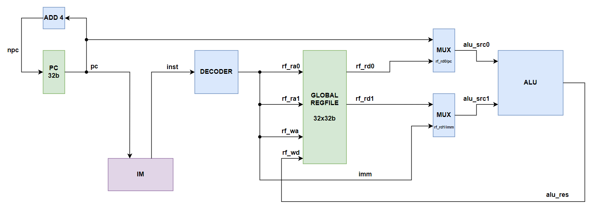

# Lab3: Simple Single Cycle CPU

---

Simple CPU can execute Shifts, Arithmetic, Logical and Compare instructions. The instructions in `INST_MEM(IM)` are read by `PC`, which is incremented by 4 each time after an instruction is executed. `DECODER` decodes the instruction in RISC-V and generates control signals, and `ALU` executes the instruction. The result is stored in `REG_FILE(RF)`, and we simplified the write back stage to write the result directly to the register.