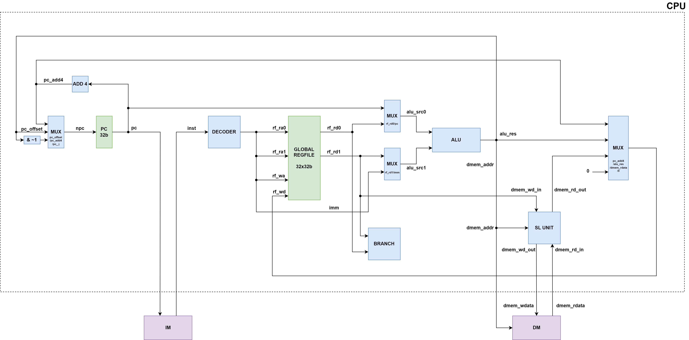

# Lab4: Complete Single Cycle CPU

---

In this lab, the CPU can excute Branch, Load, Store and Jump&Link as we add `BRANCH`， `SL_UNIT` and `DATA_MEM(DM)` modules. Our PC is selected from 3 values each time according to the operation, and the `DM` module can read and write data from/to memory. The write back is also implemented in this lab.