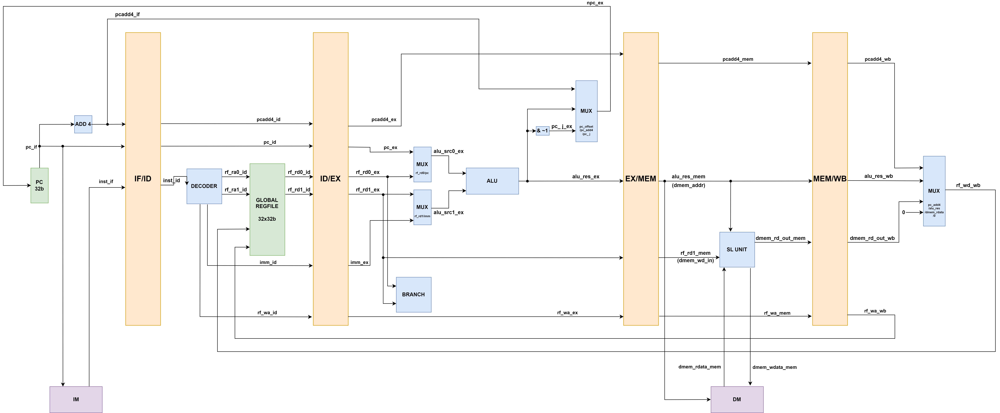

# Pipeline Hazards

---

## Pipeiline

To increase the frequency of instruction execution, we need shorten the delay in the circuit, and that is the main idea of pipelining. We devide the execution of an instruction into 5 stages:
  
- Instruction Fetch (IF)
- Instruction Decode (ID)
- Execution (EX)
- Memory Access (MEM)
- Write Back (WB)

Each stage holds one instruction and takes one clock cycle to finish. And to implement the pipelining, we need to add some registers between stages to store the signals. 

To control these registers, we input 4 control signals, which are `rst`, `en`, `flush`, and `stall`. Notice that `rst` not necessarily means 'set to zero', for example, `pc` is initialized to `0x00400000`, and `inst` is set to `0x00000013`, which is `nop`. And `flush` equals to inserting a `nop` instruction, which means all signals beside `pc` are cleared, as `nop` is implemented by `addi x0 x0 0`.

## Hazards

When two instructions are in different stages, and they have data dependencies, we have to deal with hazards. For example, let `inst1` in `WB` stage and `inst2` in `ID` stage, and `inst1` writes to `rd`, which is also the `rs1` of `inst2`. Then `inst2` will read the wrong value of `rs1`, which is the value of `rd` before `inst1` is executed. To solve this promblem, we change the register to a write-first one, and then `inst2` could read `rd` directly.

